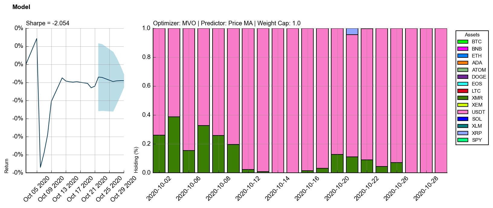

# $\mathbb{MSF}$ Capstone

## Description
Research and final application made for the MIE479 Capstone project. This repository contains all research done for the development of a Cryptocurrency and SPY portfolio optimizer.

# Set Up and Run Instructions 

This application requires Python 3.9+ and the Anaconda python package manager in order to install and manage the relevent dependencies. 

## Conda 

If you already have conda installed, you can skip this section.

Anaconda can be installed from its website with different versions depending on your operating system:

- [Anaconda for Windows](https://docs.anaconda.com/anaconda/install/windows/)
- [Anaconda for macOS](https://docs.anaconda.com/anaconda/install/mac-os/)
- [Anaconda for Linux](https://docs.anaconda.com/anaconda/install/linux/)

After following the directions, conda should be installed and functioning on your system.

## Installing our Repo

After downloading all the code and placing the repository in a location of your choice, open up a terminal window and navigate to the directory where the repo is located. 

Folders such as CVaR, Crypto Data and Factor Research should be visible. 

### Initialize a new virtual environment

Run these commands in terminal:

    conda env create -f ./Set_Up/environment.yml
    conda activate raf-sam-kelvin
    
To get the rest of the necessary packages, run:

    python setup.py
    
### Running the GUI

To run the GUI, run the command:

    python GUI/Good_Layout.py

### Common Errors
Make sure that your Matplotlib version is 3.5.3. If it is not, you can use the following commands to make it so:
`pip uninstall matplotlib`
`pip install matplotlib=3.5.3`

## What it looks like

## Created By
1. Sam Gaskin
2. Kelvin Wallace
3. Rafay Kalim

## With Help From
1. Professor Roy Kwon
2. David Islip

## How to Navigate This Repo
1. So our main UI is in the `GUI` folder. 
2. The main backtester it calls is in `FactorResearch\backtesting\backtesting.py`.
3. Most optimization functions and predictors are saved in `FactorResearch\backtesting\util.py`.
4. All CVaR functions are saved in `FactorResearch\backtesting\Series_CVaR`.

